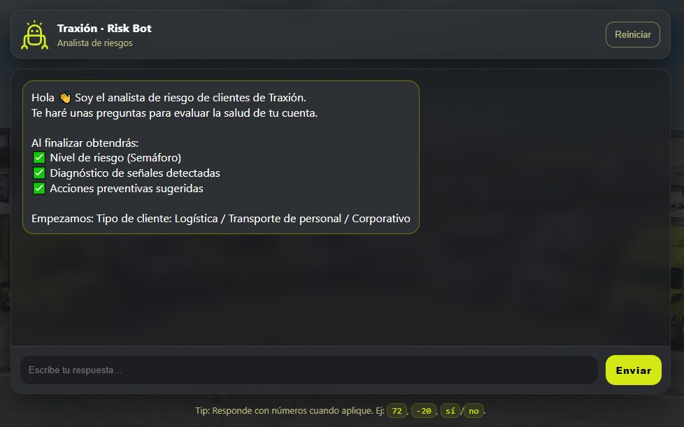
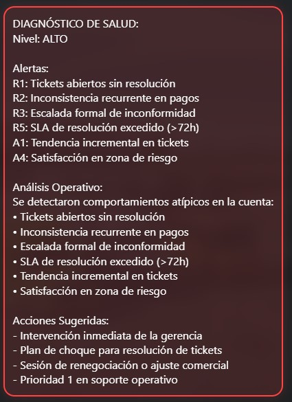
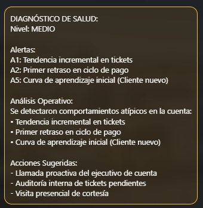
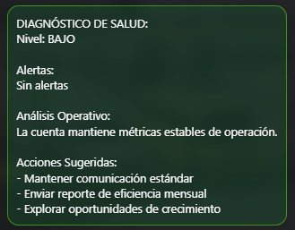

# Traxión Risk Bot - Customer Health Agent

## Descripción del Proyecto
Este sistema fue desarrollado como una solución estratégica para el **Eje 2: Detección temprana de clientes en riesgo (Customer Health)** de la Hackatón Bécalos Traxión Tech 2025.

El **Risk Bot** es un agente conversacional diseñado para estandarizar la evaluación de salud de las cuentas corporativas. Su objetivo principal es identificar señales tempranas de fricción operativa y financiera antes de que se traduzcan en una pérdida de cliente (churn), permitiendo una transición de una gestión reactiva a una cultura de prevención proactiva.

### Visualización del Sistema

## Características Principales
* **Análisis Integral**: Procesa 13 indicadores clave que abarcan el nivel de servicio, la puntualidad de pagos, la satisfacción del cliente y las variaciones de volumen operativo.
* **Sistema de Clasificación Jerárquico**: Utiliza un motor de reglas para categorizar el riesgo en niveles Bajo, Medio y Alto.
* **Explicabilidad del Diagnóstico**: Cada evaluación desglosa los códigos de alerta específicos (Señales Rojas y Amarillas) que sustentan el resultado.
* **Interfaz de Alta Fidelidad**: Diseño web responsivo basado en la identidad visual de Traxión, optimizado para uso en campo y oficina.

## Lógica de Negocio y Clasificación
El agente evalúa el riesgo mediante una matriz de criticidad basada en señales de alerta:

### 🔴 Riesgo Alto

*Se activa con: ≥2 señales Rojas O (1 Roja + ≥2 Amarillas).*
* **R1**: Tickets abiertos sin resolución (2 o más).
* **R2**: Inconsistencia recurrente en pagos (2 o más retrasos).
* **R3**: Escalada formal de inconformidad (Queja crítica).
* **R4**: Caída crítica de volumen operativo (≥30%).
* **R5**: SLA de resolución excedido (>72h).

### 🟠 Riesgo Medio

*Se activa con: 1 señal Roja O ≥2 señales Amarillas.*
* **A1**: Tendencia incremental en tickets (Mes actual > Mes anterior).
* **A2**: Primer retraso en ciclo de pago.
* **A3**: Reducción moderada de actividad (15% a 29%).
* **A4**: Satisfacción en zona de riesgo (Puntaje ≤ 7).
* **A5**: Cliente nuevo en etapa de implementación (<6 meses).

### 🟢 Riesgo Bajo (Saludable)

*Se activa con: 0 señales Rojas y máximo 1 señal Amarilla.*
* Indica que la cuenta mantiene métricas estables de operación.
* Se enfoca en el mantenimiento proactivo y reportes de eficiencia mensuales.

## Arquitectura Técnica
* **Frontend**: Interfaz construida con HTML5 y CSS3, implementando Glassmorphism para una experiencia de usuario moderna y limpia.
* **Lógica**: Motor de reglas programado en JavaScript Vanilla (ES6+), asegurando ligereza y compatibilidad sin dependencias externas.
* **Responsive Design**: Adaptación completa para dispositivos móviles y escritorio.

## Manual de Instalación y Despliegue
1. Clonar el repositorio localmente.
2. Asegurar que la estructura de archivos mantenga `index.html`, `styles.css`, `app.js` y la carpeta de `assets`.
3. Abrir `index.html` en un navegador web. No requiere servidor local ni pre-procesadores.

## Impacto Esperado
* **Reducción de Churn**: Identificación de cuentas en riesgo con antelación suficiente para ejecutar planes de retención.
* **Estandarización Operativa**: Unificación de criterios de evaluación entre diferentes territorios y coordinadores.
* **Eficiencia en la Gestión**: Priorización automática de la agenda de atención al cliente basada en datos objetivos.

## Siguientes Pasos
* **Integración de Datos**: Conexión vía API con sistemas CRM y Telemetría para automatizar la captura de métricas.
* **Dashboards Ejecutivos**: Visualización de salud de cartera a nivel nacional.
* **Mantenimiento Predictivo**: Expansión del modelo hacia el análisis de riesgo mecánico de la flota.

---
**Proyecto desarrollado para la Hackatón Bécalos Traxión Tech 2025**